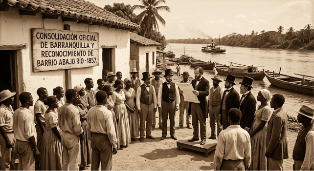
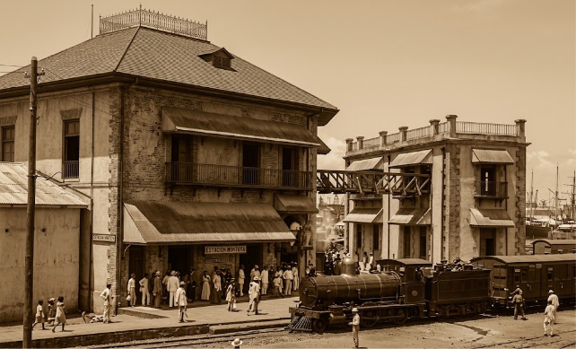
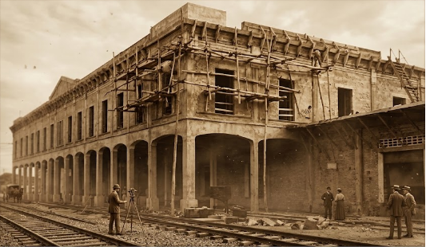
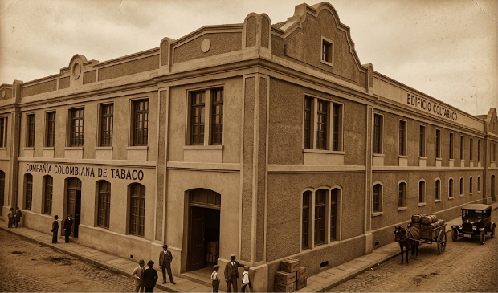
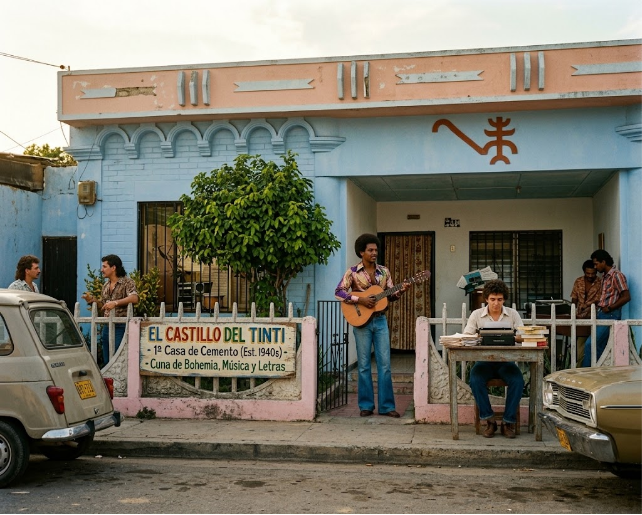
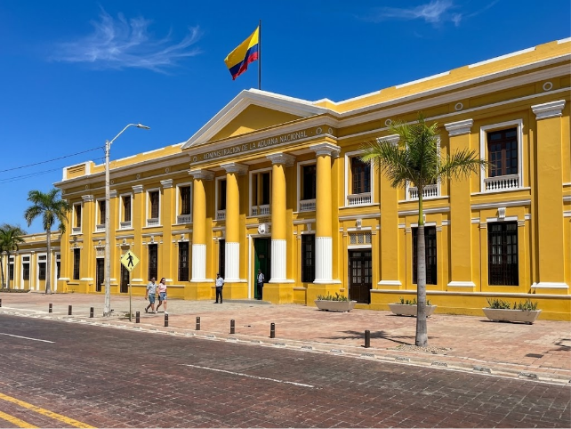
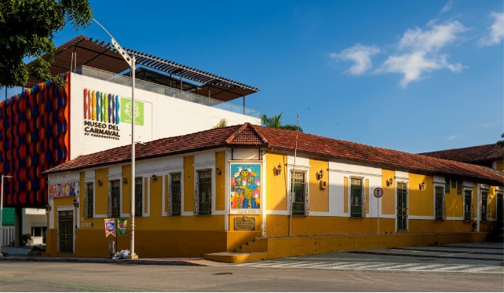
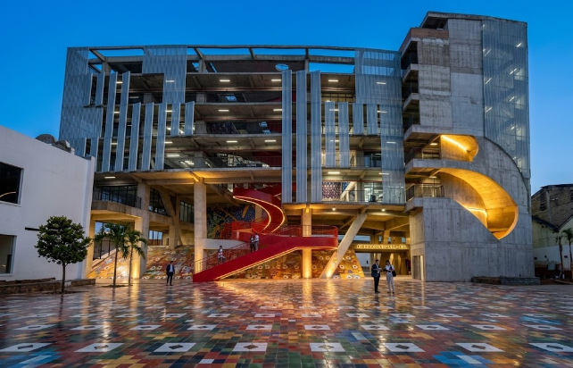
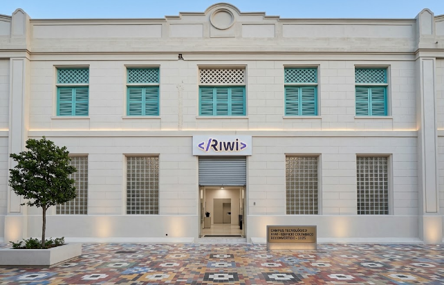
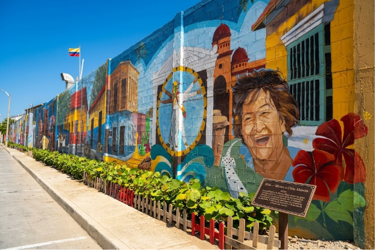

# **Cronología Histórica: Barrio Abajo y el Desarrollo de Barranquilla**

---

### **📅 1857 — Consolidación Oficial y Reconocimiento**

- **Hito:** Declaratoria de Barranquilla como ciudad y reconocimiento oficial de **"Barrio Abajo del Río"** como sector primigenio.

---

### **🚂 1872 - 1907 — Auge Portuario y Ferroviario**

- **Hito:** Desarrollo del Ferrocarril de Bolívar, grabado histórico de Édouard Riou y establecimiento de la Estación Montoya con el tranvía de tracción animal.

---

### **🏛️ 1921 — Inauguración del Palacio de la Aduana**

- **Hito:** Edificio de arquitectura neoclásica diseñado por Leslie Arbouin, equipado con rieles directos para el descargue de mercancías.

---

### **🏭 1924 — La Era Industrial (Edificio Coltabaco)**

- **Hito:** Sede monumental de la Compañía Colombiana de Tabaco, consolidándose como un hito manufacturero de la ciudad.

---

### **🎨 Década de 1980 — Epicentro Cultural y Bohemio (El Castillo del Tinti)**

- **Hito:** Primera casa de cemento del sector.
- **Legado:** Residencia de Gabriel García Márquez en su juventud (1949-1953) y taller de composición de Joe Arroyo (*Tumbatecho*, *Centurión de la Noche*).

---

### **🏛️ 1994 - 2000 — Rescate Patrimonial (Plaza de la Aduana y Casa del Carnaval)**

- **1994:** Entrega y restauración del Complejo Cultural de la Aduana.

- **2000:** Inauguración de la Casa del Carnaval en la antigua Quinta de Turín.

---

### **🎭 2019 — Museo del Carnaval**

- **Hito:** Creación de una infraestructura bioclimática de tres pisos ubicada adyacente a la Casa del Carnaval.

---

### **🏛️ 2022 — Fábrica de Cultura**

- **Hito:** Inauguración de la imponente edificación arquitectónica como la nueva sede de la Escuela Distrital de Arte y Tradiciones Populares (EDA), consolidándose como un gran centro de formación para los hacedores de la cultura.

---

### **🚀 2025 — Distrito Tecnológico e Innovador (Campus RIWI)**

- **Hito:** Reconversión del histórico Edificio Coltabaco en un campus moderno enfocado en la formación tecnológica, programación e innovación digital para el talento local.

---

### **🎨 2026 — Museo a Cielo Abierto**

- **Hito:** Consolidación de Barrio Abajo como un gran circuito artístico a través de la recuperación urbana y la creación de más de 70 murales que plasman la identidad, la danza, la tradición y la memoria cultural del sector.

